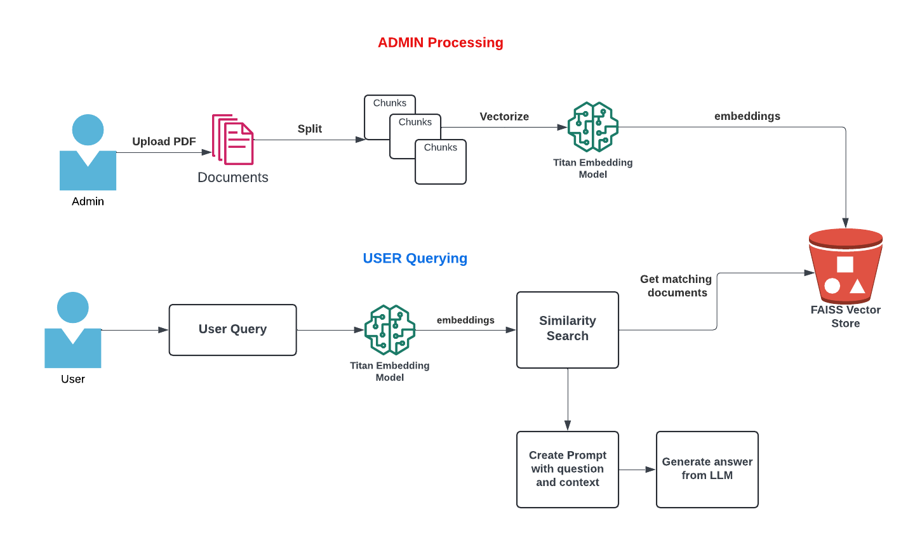
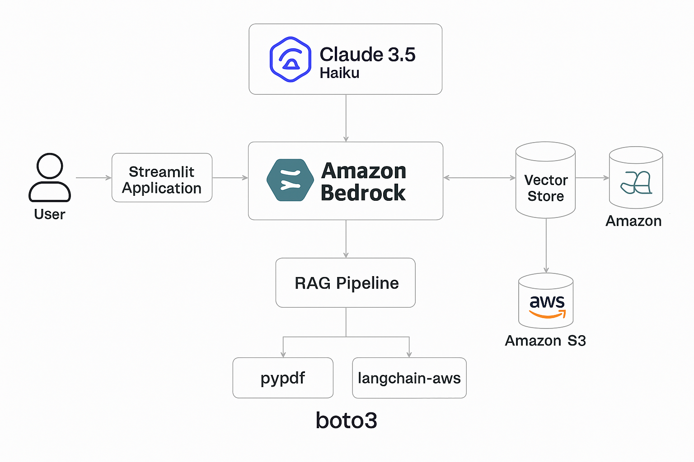

# Health-report-agentAi-analyser
Health report AI analyser

## 📌 Project Purpose

```
Healthcare reports are often difficult to understand for non-medical users.
This project aims to bridge the gap between medical data and human understanding using Artificial Intelligence.

It helps users:

✅ Understand blood test results
✅ Detect abnormal health indicators
✅ Ask medical questions in simple language
✅ Receive lifestyle & diet guidance
✅ Support doctors in clinical decisions
✅ Enable medical research & education
```
# Chat With PDF - Generative AI Application
## Built Using Amazon Bedrock, Langchain, Python, Docker, Cloudflare R2-compatible storage
## Models used:
    Amazon.titan-embed-text-v2:0 - Text
    Anthropic.Claude-3-5-haiku

## Introduction
We will build a CHATBOT like application with AWS Amazon Bedrock, docker, python, Langchain, and Streamlit. We will use Retrieval-Augmented generation concept to provide context to the Large Language model along with user query to generate response from our Knowledgebase.

In this hands-on tutorial, we will demonstrate the following:
- Architecture of the applications
- Build a applications (ADMIN and USER) and create DOCKER images


## 🏗️  System Architecture




```
User Interface (Streamlit) ↓
PDF Report Processor ↓
AI Engine (LLM + RAG)↓
Vector Database (FAISS)↓
Cloud / Storage (Cloudflare R2 / AWS S3)
```

## Quickstart

```bash
pip install -r requirements.txt
streamlit run admin.py
streamlit run app.py

```

## Cloudflare R2 setup

This app stores the generated FAISS index files in Cloudflare R2 by using R2's S3-compatible API.

Create a Cloudflare R2 bucket and an R2 API token, then add these values to Streamlit secrets:

```toml
R2_ENDPOINT_URL = "https://<account-id>.r2.cloudflarestorage.com"
R2_ACCESS_KEY_ID = "<r2-access-key-id>"
R2_SECRET_ACCESS_KEY = "<r2-secret-access-key>"
R2_BUCKET_NAME = "<r2-bucket-name>"

AWS_REGION = "us-east-1"
BEDROCK_EMBEDDING_MODEL_ID = "amazon.titan-embed-text-v2:0"
BEDROCK_CHAT_MODEL_ID = "arn:aws:bedrock:us-east-1:<account-id>:inference-profile/us.anthropic.claude-3-5-haiku-20241022-v1:0"
AWS_ACCESS_KEY_ID = "<aws-access-key-for-bedrock>"
AWS_SECRET_ACCESS_KEY = "<aws-secret-key-for-bedrock>"
```

If `R2_ENDPOINT_URL` is configured, the app uses Cloudflare R2. If it is not configured, the app falls back to AWS S3 with `BUCKET_NAME` and `AWS_S3_REGION`.

# Streamlit link
```
https://health-report-agentai-analyser.streamlit.app/
```

## ADMIN Application:
    - Build Admin Web application where AdminUser can upload the pdf.
    - The PDF text is split into chunks
    - Using the Amazon Titan Embedding Model, create the vector representation of the chunks
    - Using FAISS, save the vector index locally
    - Upload the index to a Cloudflare R2 bucket using its S3-compatible API

### Docker Commands:

Build Docker Image:
`docker build -t pdf-reader-admin .`

Run ADMIN application:
`docker run -e R2_ENDPOINT_URL=<YOUR R2 ENDPOINT> -e R2_ACCESS_KEY_ID=<YOUR R2 ACCESS KEY> -e R2_SECRET_ACCESS_KEY=<YOUR R2 SECRET KEY> -e R2_BUCKET_NAME=<YOUR R2 BUCKET NAME> -p 8083:8083 -it pdf-reader-admin`


## USER Application:
- Build User Web application where users can query / chat with the pdf.
- At the application start, download the index files from Cloudflare R2 to build local FAISS index (vector store)
- Langchain's RetrievalQA, does the following:
    - Convert the User's query to vector embedding using Amazon Titan Embedding Model (Make sure to use the same model that was used for creating the chunk's embedding on the Admin side)
    - Do similarity search to the FAISS index and retrieve 5 relevant documents pertaining to the user query to build the context
    - Using Prompt template, provide the question and context to the Large Language Model. We are using Claude model from Anthropic.
-  Display the LLM's response to the user.

### Docker Commands:

Build Docker Image:
`docker build -t pdf-reader-client .`

Run ADMIN application:
`docker run -e R2_ENDPOINT_URL=<YOUR R2 ENDPOINT> -e R2_ACCESS_KEY_ID=<YOUR R2 ACCESS KEY> -e R2_SECRET_ACCESS_KEY=<YOUR R2 SECRET KEY> -e R2_BUCKET_NAME=<YOUR R2 BUCKET NAME> -p 8084:8084 -it pdf-reader-client`


#### Note: For Docker, pass the R2 and Bedrock credentials as environment variables or through your deployment platform's secret manager.
